# Architecture

## Overview

This project is a Python ETL pipeline that extracts product listing
data from the Mercado Libre public API, transforms it into a normalized
relational shape, and loads it into PostgreSQL for analysis via SQL.

It follows a simple layered structure (loosely inspired by Clean
Architecture, without over-engineering for a project of this size):
each layer has a single responsibility and depends only on the layer
below it.

```mermaid
flowchart TD
    subgraph Config["Configuration Layer"]
        CFG[config.yaml]
        ENV[.env]
    end

    subgraph Auth["Authentication"]
        AUTH[auth.py<br/>OAuth Client Credentials]
    end

    subgraph Extract["Extract Layer"]
        API[api.py<br/>HTTP client]
        EXT[extract.py]
        SAMPLE[sample_data.py<br/>fallback dataset]
    end

    subgraph Transform["Transform Layer"]
        TRF[transform.py<br/>flatten + derive fields]
    end

    subgraph Load["Load Layer"]
        DB[database.py<br/>SQLAlchemy engine]
        LOAD[load.py<br/>INSERT into Postgres]
    end

    subgraph Storage["PostgreSQL"]
        TABLE[(etl.products)]
    end

    subgraph Analytics["Analytics"]
        SQL[sql/question1-5.sql]
    end

    CFG --> EXT
    ENV --> AUTH
    ENV --> DB
    AUTH -->|access_token| API
    API -->|GET /sites/MLA/search| EXT
    API -->|GET /currency_conversions/search| EXT
    EXT -->|403 Forbidden| SAMPLE
    SAMPLE -->|fallback rows| TRF
    EXT -->|live rows, when available| TRF
    TRF -->|normalized rows + job_run| LOAD
    LOAD --> DB
    DB --> TABLE
    TABLE --> SQL

    style SAMPLE fill:#4a2a2a,stroke:#e07070
    style API fill:#2a3a4a,stroke:#70a0e0
```

## Layers

### 1. Configuration (`config.py`, `config.yaml`, `.env`)

All non-sensitive settings (API base URL, endpoint templates, search
query, pagination limits, currency pair) live in `config.yaml`, which
is version-controlled. All sensitive values (OAuth credentials,
database connection details) live in `.env`, which is git-ignored, so
credentials never end up in source control or in a versioned config
file.

### 2. Authentication (`auth.py`)

Implements the OAuth 2.0 **Client Credentials** grant — the simplest
flow available, since it doesn't require a user to authorize the
application through a browser. It is only used where it is actually
effective: `/currency_conversions`. It does **not** unlock `/search` or
`/items`, which are blocked by platform policy independent of the
token's validity (see `decision.md`, section 1).

Tokens are cached in memory and refreshed automatically once they
approach expiration.

### 3. Extract (`api.py`, `extract.py`, `sample_data.py`)

- `api.py` is a thin HTTP client wrapper around `requests`. It
  centralizes error handling: `403` and `401` responses are converted
  into specific exception types (`MercadoLibreForbiddenError`,
  `MercadoLibreUnauthorizedError`) instead of generic HTTP errors, so
  the extract layer can react to them deliberately rather than
  crashing.
- `extract.py` orchestrates pagination (50 records per page, up to a
  configurable `max_records`) and currency conversion retrieval. Each
  extraction function follows the same pattern: try the real API call,
  and on a known/expected failure mode, fall back to
  `sample_data.py` and tag the result accordingly.
- `sample_data.py` holds a schema-accurate, hand-built sample dataset
  used only when the real API is unavailable. It is never silently
  merged with real data — the two are always distinguishable via the
  `data_source` field.

### 4. Transform (`transform.py`)

Pure functions with no side effects. Responsible only for flattening
the nested JSON structure (`seller`, `shipping`, `warranty` fields)
into flat rows matching the database schema, and for deriving two
computed fields: `has_warranty` (boolean) and `price_usd` (using the
conversion ratio from the extract layer). No business-question logic
(averages, percentages, groupings) lives here — that is handled
entirely in SQL, closer to the data.

### 5. Load (`database.py`, `load.py`)

`database.py` builds a SQLAlchemy engine from environment variables
only, applying the target schema (`etl`) via `search_path`.
`load.py` performs a bulk parameterized `INSERT`, with `ON CONFLICT
(item_id, job_run) DO NOTHING` to make re-running the pipeline safe
(idempotent) without needing to truncate the table first.

### 6. Storage (PostgreSQL — `etl.products`)

A single denormalized table (see `ddl/create_tables.sql` and
`docs/data_model.md` for the full schema) was chosen deliberately over
a multi-table star schema. Given the scope of the challenge — five
well-defined analytical questions over one entity (product listings) —
a single wide table keeps every query in `sql/` a single `SELECT ...
GROUP BY`, with no joins required, while still supporting historical
runs through the composite `(item_id, job_run)` key.

### 7. Analytics (`sql/question1.sql` – `question5.sql`)

Each file answers exactly one of the challenge's five questions,
always scoped to the most recent `job_run`. Kept as plain, readable
SQL files (not embedded in Python) so they can be run, reviewed, and
modified independently of the application code — this is also what
the challenge explicitly asks to be included in the README.

## Error Handling Philosophy

The pipeline distinguishes between three categories of failure, and
handles each differently:

| Failure | Example | Handling |
|---|---|---|
| **Policy-blocked** (expected) | `403` on `/search` | Caught, logged as a warning, falls back to sample data. Pipeline continues. |
| **Missing/invalid credentials** (expected, recoverable) | `401` on `/currency_conversions` without a token | Caught, logged as a warning, falls back to sample rate. Pipeline continues. |
| **Unexpected** (not expected) | Network timeout, 5xx, malformed JSON | Not caught — propagates and stops the run, so failures are never silently swallowed or hidden behind a fallback that could mask a real bug. |

This distinction matters: fallback behavior is reserved strictly for
*known, documented, external* conditions — not used as a blanket
try/except around the whole pipeline.

## Why Not Docker / Airflow / dbt for This Challenge

Given the one-week timeframe and the scope (a single scheduled/manual
batch job, not a recurring production pipeline), I intentionally kept
the stack minimal: plain Python, SQLAlchemy, and PostgreSQL. Docker,
Airflow, dbt, Poetry, and similar tools would add setup and review
overhead disproportionate to the problem size. These are noted as
natural next steps for productionization in `decision.md`.