# Arquitectura

> *Nota: esta traducción al español fue elaborada con asistencia de
> IA, ya que el español no es mi lengua nativa.*

## Visión General

Este proyecto es un pipeline ETL en Python que extrae datos de
publicaciones de productos de la API pública de Mercado Libre, los
transforma en una estructura relacional normalizada, y los carga en
PostgreSQL para su análisis vía SQL.

Sigue una estructura por capas simple (inspirada libremente en Clean
Architecture, sin sobre-diseñar para un proyecto de este tamaño): cada
capa tiene una única responsabilidad y depende solo de la capa
inferior.

```mermaid
flowchart TD
    subgraph Config["Capa de Configuración"]
        CFG[config.yaml]
        ENV[.env]
    end

    subgraph Auth["Autenticación"]
        AUTH[auth.py<br/>OAuth Client Credentials]
    end

    subgraph Extract["Capa de Extracción"]
        API[api.py<br/>Cliente HTTP]
        EXT[extract.py]
        SAMPLE[sample_data.py<br/>dataset de fallback]
    end

    subgraph Transform["Capa de Transformación"]
        TRF[transform.py<br/>aplanar + derivar campos]
    end

    subgraph Load["Capa de Carga"]
        DB[database.py<br/>motor SQLAlchemy]
        LOAD[load.py<br/>INSERT en Postgres]
    end

    subgraph Storage["PostgreSQL"]
        TABLE[(etl.products)]
    end

    subgraph Analytics["Analítica"]
        SQL[sql/question1-5.sql]
    end

    CFG --> EXT
    ENV --> AUTH
    ENV --> DB
    AUTH -->|access_token| API
    API -->|GET /sites/MLA/search| EXT
    API -->|GET /currency_conversions/search| EXT
    EXT -->|403 Forbidden| SAMPLE
    SAMPLE -->|filas de fallback| TRF
    EXT -->|filas reales, cuando disponibles| TRF
    TRF -->|filas normalizadas + job_run| LOAD
    LOAD --> DB
    DB --> TABLE
    TABLE --> SQL

    style SAMPLE fill:#4a2a2a,stroke:#e07070
    style API fill:#2a3a4a,stroke:#70a0e0
```

## Capas

### 1. Configuración (`config.py`, `config.yaml`, `.env`)

Toda la configuración no sensible (URL base de la API, plantillas de
endpoints, query de búsqueda, límites de paginación, par de monedas)
vive en `config.yaml`, versionado en el repositorio. Todos los valores
sensibles (credenciales OAuth, datos de conexión a la base de datos)
viven en `.env`, ignorado por git, para que las credenciales nunca
terminen en el control de versiones ni en un archivo de configuración
versionado.

### 2. Autenticación (`auth.py`)

Implementa el flujo OAuth 2.0 **Client Credentials** — el más simple
disponible, ya que no requiere que un usuario autorice la aplicación a
través de un navegador. Solo se usa donde realmente es efectivo:
`/currency_conversions`. **No** desbloquea `/search` ni `/items`, que
están bloqueados por política de la plataforma independientemente de
la validez del token (ver `decision.md`, sección 1).

Los tokens se almacenan en caché en memoria y se renuevan
automáticamente al acercarse a su expiración.

### 3. Extracción (`api.py`, `extract.py`, `sample_data.py`)

- `api.py` es un wrapper HTTP delgado alrededor de `requests`.
  Centraliza el manejo de errores: las respuestas `403` y `401` se
  convierten en tipos de excepción específicos
  (`MercadoLibreForbiddenError`, `MercadoLibreUnauthorizedError`) en
  lugar de errores HTTP genéricos, para que la capa de extracción
  pueda reaccionar deliberadamente en vez de fallar.
- `extract.py` orquesta la paginación (50 registros por página, hasta
  un `max_records` configurable) y la obtención de la tasa de cambio.
  Cada función de extracción sigue el mismo patrón: intenta la llamada
  real a la API, y ante un modo de falla conocido/esperado, recurre a
  `sample_data.py` y etiqueta el resultado en consecuencia.
- `sample_data.py` contiene un dataset de muestra construido a mano,
  fiel al esquema real, usado solo cuando la API real no está
  disponible. Nunca se combina silenciosamente con datos reales — los
  dos siempre son distinguibles vía el campo `data_source`.

### 4. Transformación (`transform.py`)

Funciones puras, sin efectos secundarios. Responsables únicamente de
aplanar la estructura JSON anidada (campos `seller`, `shipping`,
`warranty`) en filas planas que coinciden con el esquema de la base de
datos, y de derivar dos campos calculados: `has_warranty` (booleano) y
`price_usd` (usando la tasa de conversión de la capa de extracción).
Ninguna lógica de las preguntas de negocio (promedios, porcentajes,
agrupaciones) vive aquí — eso se maneja completamente en SQL, más
cerca de los datos.

### 5. Carga (`database.py`, `load.py`)

`database.py` construye un motor SQLAlchemy solo a partir de variables
de entorno, aplicando el schema destino (`etl`) vía `search_path`.
`load.py` realiza un `INSERT` masivo parametrizado, con `ON CONFLICT
(item_id, job_run) DO NOTHING` para que volver a correr el pipeline sea
seguro (idempotente) sin necesidad de truncar la tabla primero.

### 6. Almacenamiento (PostgreSQL — `etl.products`)

Se eligió deliberadamente una única tabla desnormalizada en lugar de un
esquema en estrella multi-tabla. Dado el alcance del desafío — cinco
preguntas analíticas bien definidas sobre una sola entidad
(publicaciones de productos) —, una única tabla ancha mantiene cada
consulta en `sql/` como un simple `SELECT ... GROUP BY`, sin joins
necesarios, a la vez que soporta corridas históricas mediante la clave
compuesta `(item_id, job_run)`.

### 7. Analítica (`sql/question1.sql` – `question5.sql`)

Cada archivo responde exactamente una de las cinco preguntas del
desafío, siempre limitada al `job_run` más reciente. Se mantienen como
archivos SQL simples y legibles (no embebidos en Python) para que
puedan ejecutarse, revisarse y modificarse independientemente del
código de la aplicación — que es justo lo que el desafío pide
explícitamente incluir en el README.

## Filosofía de Manejo de Errores

El pipeline distingue tres categorías de falla, y maneja cada una de
forma distinta:

| Falla | Ejemplo | Manejo |
|---|---|---|
| **Bloqueada por política** (esperada) | `403` en `/search` | Se captura, se registra como warning, recurre al dataset de muestra. El pipeline continúa. |
| **Credenciales faltantes/inválidas** (esperada, recuperable) | `401` en `/currency_conversions` sin token | Se captura, se registra como warning, recurre a la tasa de muestra. El pipeline continúa. |
| **Inesperada** (no esperada) | Timeout de red, 5xx, JSON mal formado | No se captura — se propaga y detiene la corrida, para que las fallas nunca se oculten silenciosamente detrás de un fallback que podría enmascarar un bug real. |

Esta distinción importa: el comportamiento de fallback está reservado
estrictamente para condiciones *conocidas, documentadas y externas* —
no se usa como un try/except genérico envolviendo todo el pipeline.

## Por Qué No Docker / Airflow / dbt para Este Desafío

Dado el plazo de una semana y el alcance (un job batch único,
manual/programado, no un pipeline de producción recurrente), mantuve
deliberadamente el stack mínimo: Python plano, SQLAlchemy y
PostgreSQL. Docker, Airflow, dbt, Poetry y herramientas similares
agregarían overhead de configuración y revisión desproporcionado al
tamaño del problema. Estos se anotan como próximos pasos naturales para
productivización en `decision.md`.