# Arquitetura

## Visão Geral

Este projeto é um pipeline ETL em Python que extrai dados de
publicações de produtos da API pública do Mercado Livre, transforma-os
em uma estrutura relacional normalizada, e os carrega no PostgreSQL
para análise via SQL.

Segue uma estrutura em camadas simples (livremente inspirada em Clean
Architecture, sem super-engenharia para um projeto deste tamanho):
cada camada tem uma única responsabilidade e depende apenas da camada
abaixo dela.

```mermaid
flowchart TD
    subgraph Config["Camada de Configuração"]
        CFG[config.yaml]
        ENV[.env]
    end

    subgraph Auth["Autenticação"]
        AUTH[auth.py<br/>OAuth Client Credentials]
    end

    subgraph Extract["Camada de Extração"]
        API[api.py<br/>Cliente HTTP]
        EXT[extract.py]
        SAMPLE[sample_data.py<br/>dataset de fallback]
    end

    subgraph Transform["Camada de Transformação"]
        TRF[transform.py<br/>achatar + derivar campos]
    end

    subgraph Load["Camada de Carga"]
        DB[database.py<br/>engine SQLAlchemy]
        LOAD[load.py<br/>INSERT no Postgres]
    end

    subgraph Storage["PostgreSQL"]
        TABLE[(etl.products)]
    end

    subgraph Analytics["Analítica"]
        SQL[sql/question1-5.sql]
    end

    CFG --> EXT
    ENV --> AUTH
    ENV --> DB
    AUTH -->|access_token| API
    API -->|GET /sites/MLA/search| EXT
    API -->|GET /currency_conversions/search| EXT
    EXT -->|403 Forbidden| SAMPLE
    SAMPLE -->|linhas de fallback| TRF
    EXT -->|linhas reais, quando disponíveis| TRF
    TRF -->|linhas normalizadas + job_run| LOAD
    LOAD --> DB
    DB --> TABLE
    TABLE --> SQL

    style SAMPLE fill:#4a2a2a,stroke:#e07070
    style API fill:#2a3a4a,stroke:#70a0e0
```

## Camadas

### 1. Configuração (`config.py`, `config.yaml`, `.env`)

Todas as configurações não sensíveis (URL base da API, templates de
endpoints, query de busca, limites de paginação, par de moedas) vivem
em `config.yaml`, versionado no repositório. Todos os valores
sensíveis (credenciais OAuth, dados de conexão do banco) vivem em
`.env`, ignorado pelo git, para que credenciais nunca acabem no
controle de versão nem em um arquivo de configuração versionado.

### 2. Autenticação (`auth.py`)

Implementa o fluxo OAuth 2.0 **Client Credentials** — o mais simples
disponível, já que não exige que um usuário autorize a aplicação
através de um navegador. É usado apenas onde realmente é eficaz:
`/currency_conversions`. **Não** desbloqueia `/search` nem `/items`,
que estão bloqueados por política da plataforma independente da
validade do token (ver `decision.md`, seção 1).

Os tokens são armazenados em cache na memória e renovados
automaticamente à medida que se aproximam da expiração.

### 3. Extração (`api.py`, `extract.py`, `sample_data.py`)

- `api.py` é um wrapper HTTP fino em torno do `requests`. Centraliza o
  tratamento de erros: respostas `403` e `401` são convertidas em
  tipos de exceção específicos (`MercadoLibreForbiddenError`,
  `MercadoLibreUnauthorizedError`) em vez de erros HTTP genéricos, para
  que a camada de extração possa reagir deliberadamente em vez de
  quebrar.
- `extract.py` orquestra a paginação (50 registros por página, até um
  `max_records` configurável) e a obtenção da taxa de câmbio. Cada
  função de extração segue o mesmo padrão: tenta a chamada real à API,
  e diante de um modo de falha conhecido/esperado, recorre ao
  `sample_data.py` e etiqueta o resultado adequadamente.
- `sample_data.py` contém um dataset de amostra construído à mão,
  fiel ao esquema real, usado apenas quando a API real está
  indisponível. Nunca é combinado silenciosamente com dados reais — os
  dois são sempre distinguíveis via o campo `data_source`.

### 4. Transformação (`transform.py`)

Funções puras, sem efeitos colaterais. Responsáveis apenas por achatar
a estrutura JSON aninhada (campos `seller`, `shipping`, `warranty`) em
linhas planas que correspondem ao esquema do banco de dados, e por
derivar dois campos calculados: `has_warranty` (booleano) e
`price_usd` (usando a taxa de conversão da camada de extração).
Nenhuma lógica das perguntas de negócio (médias, percentuais,
agrupamentos) vive aqui — isso é tratado inteiramente em SQL, mais
próximo dos dados.

### 5. Carga (`database.py`, `load.py`)

`database.py` constrói uma engine SQLAlchemy apenas a partir de
variáveis de ambiente, aplicando o schema de destino (`etl`) via
`search_path`. `load.py` executa um `INSERT` em lote parametrizado,
com `ON CONFLICT (item_id, job_run) DO NOTHING` para que rodar o
pipeline novamente seja seguro (idempotente) sem precisar truncar a
tabela antes.

### 6. Armazenamento (PostgreSQL — `etl.products`)

Optei deliberadamente por uma única tabela desnormalizada em vez de um
esquema estrela com múltiplas tabelas. Dado o escopo do desafio —
cinco perguntas analíticas bem definidas sobre uma única entidade
(publicações de produtos) —, uma única tabela larga mantém cada
consulta em `sql/` como um simples `SELECT ... GROUP BY`, sem
necessidade de joins, ao mesmo tempo em que suporta execuções
históricas através da chave composta `(item_id, job_run)`.

### 7. Analítica (`sql/question1.sql` – `question5.sql`)

Cada arquivo responde exatamente uma das cinco perguntas do desafio,
sempre limitada ao `job_run` mais recente. Mantidos como arquivos SQL
simples e legíveis (não embutidos em Python) para que possam ser
executados, revisados e modificados independentemente do código da
aplicação — que é exatamente o que o desafio pede explicitamente para
incluir no README.

## Filosofia de Tratamento de Erros

O pipeline distingue três categorias de falha, e trata cada uma de
forma diferente:

| Falha | Exemplo | Tratamento |
|---|---|---|
| **Bloqueada por política** (esperada) | `403` em `/search` | Capturada, registrada como warning, recorre ao dataset de amostra. O pipeline continua. |
| **Credenciais ausentes/inválidas** (esperada, recuperável) | `401` em `/currency_conversions` sem token | Capturada, registrada como warning, recorre à taxa de amostra. O pipeline continua. |
| **Inesperada** (não esperada) | Timeout de rede, 5xx, JSON malformado | Não capturada — se propaga e interrompe a execução, para que falhas nunca sejam silenciosamente engolidas por um fallback que poderia mascarar um bug real. |

Essa distinção importa: o comportamento de fallback é reservado
estritamente para condições *conhecidas, documentadas e externas* —
não é usado como um try/except genérico envolvendo todo o pipeline.

## Por Que Não Docker / Airflow / dbt Neste Desafio

Dado o prazo de uma semana e o escopo (um job batch único,
manual/agendado, não um pipeline de produção recorrente), mantive
deliberadamente a stack mínima: Python puro, SQLAlchemy e PostgreSQL.
Docker, Airflow, dbt, Poetry e ferramentas similares adicionariam
overhead de configuração e revisão desproporcional ao tamanho do
problema. Isso está anotado como próximos passos naturais para
produtização em `decision.md`.